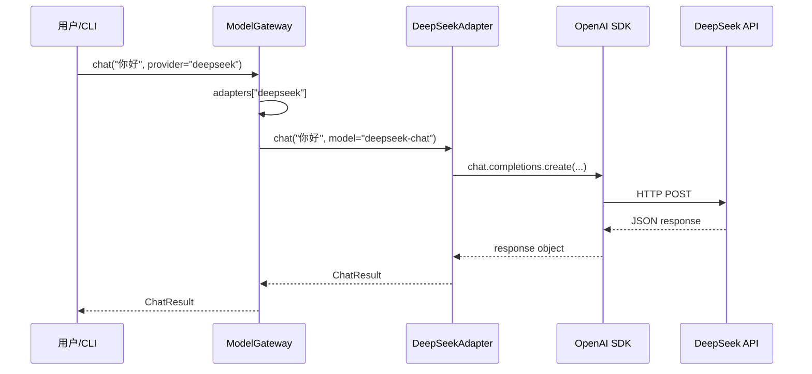

# Chat Completions 请求 / 响应（速查）

DeepSeek、Kimi、通义等国内厂商大多兼容 **OpenAI Chat Completions** 格式，换 `base_url` + `api_key` 即可。Lab-01 和 P1 Gateway 都是这套。

## 请求：发什么

| 字段 | 必填 | 说明 |
|------|------|------|
| `model` | ✓ | 模型名，如 `deepseek-chat` |
| `messages` | ✓ | 对话数组，每项 `{ role, content }` |
| `role` | ✓ | 常见：`system`（系统指令）、`user`（用户）、`assistant`（模型历史回复） |
| `content` | ✓ | 文本内容 |

单次调用最小形态：`messages=[{"role": "user", "content": "你好"}]`。

## 响应：拿什么

| 路径 | 说明 |
|------|------|
| `choices[0].message.content` | **模型回复文本**（业务最常用） |
| `choices[0].message.role` | 一般为 `assistant` |
| `model` | 实际使用的模型名 |
| `usage` | token 用量（计费 / 监控用，可能为空） |

## usage：三个 token 字段

| 字段 | 含义 |
|------|------|
| `prompt_tokens` | 输入侧 token 数（含 system + 历史 + 当前 user） |
| `completion_tokens` | 模型生成回复的 token 数 |
| `total_tokens` | 前两者之和，**计费通常看这个** |

实践对照：`coding/labs/01-hello-llm/main.py` 打印 usage；Gateway 的 `ChatResult` 把这三个字段统一封装，上层不用碰原始响应。

## 最小调用（对照 Lab-01）

```python
client = OpenAI(api_key=..., base_url="https://api.deepseek.com/v1")
response = client.chat.completions.create(
    model="deepseek-chat",
    messages=[{"role": "user", "content": "你好"}],
)
text = response.choices[0].message.content
usage = response.usage  # prompt_tokens / completion_tokens / total_tokens
```

## 常见错误码（知道即可，D3 加重试）

| 码 | 含义 | 处理思路 |
|----|------|----------|
| 401 | Key 无效或未传 | 检查 `.env` |
| 429 | 限流 | 退避重试 |
| 5xx | 服务端异常 | 可重试 |

---

# Model Gateway 的设计

## 要解决什么问题

上层（CLI、Agent、业务代码）**只调一个入口** `ModelGateway.chat()`，不用关心背后是 DeepSeek、Kimi 还是 OpenAI。

核心思路：**Gateway（路由） + Adapter（适配） + Config（配置）**

## 分层架构

```text
┌─────────────────────────────────────────┐
│  CLI (cli.py)          Typer 命令行入口   │
└──────────────────┬──────────────────────┘
                   │ ModelGateway()
┌──────────────────▼──────────────────────┐
│  Gateway (gateway.py)    统一入口 + 路由  │
│  - load_providers()                      │
│  - _build_adapters()                     │
│  - chat(message, provider?, model?)      │
└──────────────────┬──────────────────────┘
                   │ dict[name → Adapter]
┌──────────────────▼──────────────────────┐
│  Adapter (adapters/)     各厂商实现       │
│  - ChatAdapter (Protocol 接口)            │
│  - OpenAICompatAdapter (通用实现)         │
│  - DeepSeek / Moonshot / OpenAI 子类      │
└──────────────────┬──────────────────────┘
                   │ openai-python SDK
┌──────────────────▼──────────────────────┐
│  厂商 API (HTTP)                         │
└─────────────────────────────────────────┘

         Config (config.py) 横切各层
         .env → ProviderConfig
```

## 目录与职责

| 文件 | 职责 |
|------|------|
| `config.py` | 读 `.env`，产出 `ProviderConfig`；没 Key 的厂商不进字典 |
| `gateway.py` | 组装 Adapter 字典，按 `provider` 名路由 |
| `adapters/base.py` | `ChatResult` 数据结构 + `ChatAdapter` 协议（接口） |
| `adapters/openai_compat.py` | **通用实现**：OpenAI SDK + 换 `base_url` |
| `adapters/deepseek.py` 等 | 薄包装，预留厂商扩展点 |
| `cli.py` | 命令行：`chat` / `providers` / `bench` |

## 核心数据结构

### ProviderConfig（配置层）

```python
@dataclass(frozen=True)
class ProviderConfig:
    name: str           # "deepseek"
    api_key: str
    base_url: str
    default_model: str
```

- `frozen=True`：不可变，防误改
- **有 Key 才加载**：`load_providers()` 返回 `dict[str, ProviderConfig]`

### ChatResult（返回层）

```python
@dataclass
class ChatResult:
    content: str
    model: str
    provider: str
    prompt_tokens / completion_tokens / total_tokens
    latency_ms
```

统一各厂商响应格式，上层只认 `ChatResult`。

### ChatAdapter（接口层）

```python
class ChatAdapter(Protocol):
    provider: str
    def chat(self, message, *, model=None) -> ChatResult: ...
```

类似 TypeScript `interface`，不要求继承，只要实现 `chat()` 即可。

## Gateway 生命周期

### 初始化（`ModelGateway.__init__`）

```text
1. load_providers()          → 读 .env，得到已配置厂商
2. get_default_provider()    → 默认 "deepseek"（可用 DEFAULT_PROVIDER 覆盖）
3. _build_adapters()         → 只为「有 Key 的厂商」实例化 Adapter
```

### `_build_adapters` 路由表

| provider 名 | Adapter 类 | 说明 |
|-------------|-----------|------|
| `deepseek` | `DeepSeekAdapter` | 继承通用实现 |
| `moonshot` | `MoonshotAdapter` | 同上 |
| `openai` | `OpenAIProviderAdapter` | 同上 |
| `dashscope` | `OpenAICompatAdapter` | 无专用类，直接用通用 |

国内厂商大多兼容 OpenAI Chat Completions，所以共用一个 `OpenAICompatAdapter`，只换 `base_url` + `api_key`。

### 调用（`chat()`）

```text
1. name = provider 参数 or 默认 provider
2. 查 self._adapters[name]，没有 → ValueError
3. model_name = model 参数 or 该厂商 default_model
4. return self._adapters[name].chat(message, model=model_name)
```

字典查找 + 委托，没有复杂策略模式。

## Adapter 实现链

```text
ChatAdapter (Protocol)
    ↑ 结构化实现
OpenAICompatAdapter          ← 真正干活的
    ├── DeepSeekAdapter      ← 目前只是 super().__init__(cfg)
    ├── MoonshotAdapter
    └── OpenAIProviderAdapter
```

`OpenAICompatAdapter.chat()` 做的事：

1. `OpenAI(api_key=..., base_url=...)`
2. `client.chat.completions.create(model, messages)`
3. 解析 `choices[0].message.content` + `usage`
4. 包装成 `ChatResult`

DeepSeek 单独一个 py：现在只是继承一行，但分文件便于单独 import、以后加厂商特殊逻辑。

## 配置与环境变量

| 变量 | 作用 |
|------|------|
| `DEEPSEEK_API_KEY` | 有则启用 deepseek |
| `DEEPSEEK_BASE_URL` | 可选，默认 `https://api.deepseek.com/v1` |
| `DEFAULT_MODEL` | deepseek 默认模型 |
| `DEFAULT_PROVIDER` | Gateway 默认路由目标 |
| `MOONSHOT_*` / `DASHSCOPE_*` / `OPENAI_*` | 同理 |

没 Key = 不存在。`available_providers` 只列已配置的。

## CLI 入口

```bash
python -m model_gateway.cli chat "你好"
python -m model_gateway.cli chat "你好" --provider moonshot
python -m model_gateway.cli providers
```

CLI 很薄：建 `ModelGateway()` → 调 `chat()` → 打印 `ChatResult`。

## 一次完整调用链路



## 测试策略

| 类型 | 标记 | 做法 |
|------|------|------|
| 单元测试 | 无 | `patch load_providers` + `patch OpenAI`，不连网 |
| 集成测试 | `@pytest.mark.integration` | 真 Key + 真 API，`pytest -m integration` |

mock 替换的是**外部依赖**（配置加载、HTTP 客户端），测的是**自己的解析和路由逻辑**。

## 设计模式小结

| 模式 | 体现 |
|------|------|
| Facade（外观） | `ModelGateway` 隐藏多厂商细节 |
| Adapter（适配器） | 各厂商 API → 统一 `ChatResult` |
| Strategy（策略） | `dict[name → Adapter]`，运行时选厂商 |
| Protocol（协议） | `ChatAdapter` 定义契约，松耦合 |

## 扩展新厂商

1. `config.py`：`load_providers()` 加一组 `_provider(...)`
2. 若兼容 OpenAI：Gateway 里映射到 `OpenAICompatAdapter`，或新建 `XxxAdapter(OpenAICompatAdapter)`
3. 若不兼容：新建 Adapter，实现 `chat() → ChatResult`
4. `gateway.py` `_build_adapters` 的 `mapping` 加一项

## 当前局限 / 后续可演进

- 只支持单轮 `user` 消息，无多轮对话 / system prompt
- 无流式（stream）、重试、熔断、限流
- `bench` 命令尚未实现
- Gateway 路由是静态映射，非插件化动态发现

## 一句话总结

> **Config 决定「谁能用」，Gateway 决定「找谁」，Adapter 决定「怎么调」，ChatResult 统一「返回什么」。**

国内厂商走 OpenAI 兼容接口，所以一个 `OpenAICompatAdapter` + 不同 `base_url` 就能覆盖大部分场景。

