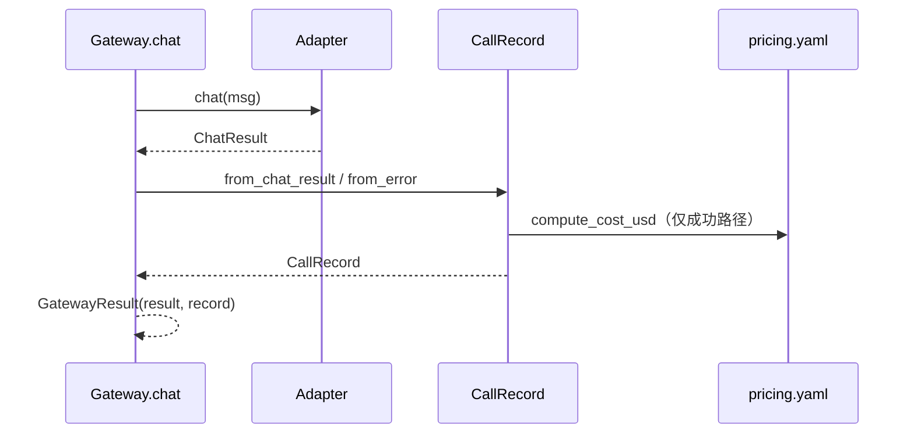

# 费用与用量（D5 速查）

D4 控**速率**，D5 记**花了多少 token、多少钱、多久**——为 D6 bench 和后续成本路由打基础。

## usage：API 返回的事实

OpenAI 兼容接口在响应里带 `usage` 对象（可能为空）：

| 字段 | 含义 | 计费角色 |
|------|------|----------|
| `prompt_tokens` | 输入侧 token | 按 input 单价 |
| `completion_tokens` | 模型生成 token | 按 output 单价 |
| `total_tokens` | 两者之和 | 粗算总量 |

Gateway 的 `ChatResult` 已在 `openai_compat.py` 里解析这三个字段；**D5 不再改 Adapter**，只在 Gateway 出口包装 `CallRecord`。

类比：TS 里 API DTO 的 `usage` 字段 → `CallRecord` 是加了一层 **derived metrics**（latency、cost）。

## cost：客户端折算，不是 API 字段

```text
cost_usd = prompt_tokens × input_price/1M + completion_tokens × output_price/1M
```

价格表：`config/pricing.yaml`，按 **model 名**查；未知模型走 `default`。

## 三层分工（正确版）

```text
Adapter（事实层）  OpenAICompatAdapter.chat → ChatResult（content + usage + latency）
Gateway（挂载点）  gateway.py:81-87 → 成功/失败都产 CallRecord
观测（转换层）    CallRecord.from_chat_result / from_error + compute_cost_usd
聚合（批量层）    MetricsCollector.add + summary()
```



---

## 复盘：自答三点对照（D5 结束）

> 以下记录本人 D5 结束时的理解；**❌ 标记即时错误/不到位**，✅ 标记已纠正的认知。

### 1. 观测层在哪？CallRecord 是什么？

**我的原话（摘要）**：Gateway 选 adapter → 拿 `ChatResult` → `CallRecord` 类方法算消费；CallRecord 像中间层，过滤指定 ChatAdapter（如 DeepSeek），走 base 层 OpenAICompatAdapter 取初始信息，再经 pricing.yaml 得出信息对象。

| 判定 | 内容 |
|:---|:---|
| ✅ | 观测挂载点在 `gateway.py:81-87`；成功走 `from_chat_result`，失败走 `from_error` |
| ✅ | 事实数据来自 Adapter 已完成的 `ChatResult`（`openai_compat.py:51-59` 解析 usage） |
| ✅ | `cost_usd` 由 `pricing.yaml` + `compute_cost_usd` 客户端折算 |
| ❌ | **CallRecord 不会「过滤 / 穿透」Adapter 链**——Adapter 调用结束时它才开始工作，只做字段拷贝 + 算 cost，不再碰 HTTP/SDK |
| ❌ | **DeepSeekAdapter 与 CallRecord 无直接调用关系**；继承链在 Adapter 内部，观测层只看到扁平 `ChatResult` |

**纠正后一句话**：Adapter 产**事实**，Gateway 出口 + CallRecord 产**观测**；CallRecord 是**纯转换函数**，不是 Adapter 中间件。

---

### 2. 记什么？summary 怎么汇总？

**我的原话（摘要）**：记通用 token 消耗 + 配置表价格 → 汇总某一模型消费；`MetricsCollector.summary()` 汇总每个模型的调用。

| 判定 | 内容 |
|:---|:---|
| ✅ | 单次 `CallRecord`：tokens、latency、cost_usd、success、error_type、timestamp |
| ✅ | `cost_usd` 不是 API 字段，是 pricing 策略算出来的 |
| ❌ | **当前 `summary()` 是整批全局汇总**，不是按 model 分桶——无 `by_model` 字段 |
| ⚠️ | 混跑多 model 时，summary 只能看总 token/总 cost；按 model 拆分需 D6+ 加 `groupby(r.model)` |

**纠正后一句话**：D5 记**单次快照**；Collector 做**全局** success_rate / total_cost / P95，按 model 分桶是下一步。

---

### 3. 失败怎么办？

**我的原话（摘要）**：`chat` 里 `catch Exception` → `CallRecord.from_error` → 返回带 record 的 `GatewayResult`。

| 判定 | 内容 |
|:---|:---|
| ✅ | 失败也产 record（tokens=0, cost=0, success=False, error_type=异常类名） |
| ✅ | 适合 bench 统计 success_rate，不丢观测数据 |
| ⚠️ | 失败时 `result=None`，**不再抛异常**——调用方须判 `gw.result is None` |
| ⚠️ | `except Exception` 过宽，配置类 `ValueError` 也会被吞成 failed record |
| ⚠️ | CLI 已补：失败时打印 error_type 并以 exit 1 退出 |

**纠正后一句话**：失败路径为「观测完整、错误不自动上抛」；与 D3「失败即 raise」是刻意 trade-off。

---

## CallRecord vs ChatResult

```text
ChatResult     — Adapter 层：content + tokens + latency_ms
CallRecord     — 观测层：+ cost_usd + success + error_type + timestamp
GatewayResult  — chat() 返回：{ result: ChatResult | None, record: CallRecord }
```

## MetricsCollector：内存聚合

D6 bench：`collector.add(gw.record)` → `summary()` → dump JSON。

| 字段 | 算法 |
|------|------|
| `success_rate` | success 数 / 总数 |
| `total_tokens` | sum(total_tokens) |
| `total_cost_usd` | sum(cost_usd) |
| `p95_latency_ms` | 仅 success 的 latency 排序取 95 分位 |

## 与 D3/D4 分层

```text
D3 retry/timeout  — IO 层扛失败
D4 ratelimit      — 入口控速率
D5 metrics        — 出口记观测
D6 bench          — 批量跑 + 汇总报告
```

## 常见坑

| 坑 | 处理 |
|----|------|
| `usage` 为 null | token 填 0，cost 为 0 |
| model 名与 pricing 键不一致 | 静默走 default，账单可能错 |
| 重试 sleep 计入 latency | D5 接受；精细拆分留后续 |
| 以为 summary 按 model 分桶 | 当前未实现，勿混淆 |

## 一句话

> **usage 是 API 给的，cost 是你算的，CallRecord 是单次快照，Collector 是 bench 的全局账本。**
