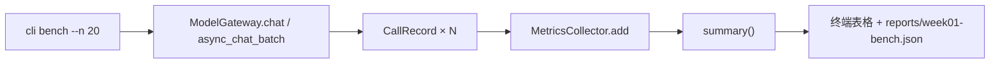

# Bench 与观测报告（D6 速查）

D5 记**单次**，D6 把 N 次调用串成**可复现报告**——这是 W1 周验收的核心。

## D6 在整条链上的位置

```text
D3 retry/timeout  — 单次 IO 扛失败
D4 ratelimit      — 批量入口控速率
D5 CallRecord     — 单次出口记观测
D6 bench          — N 次循环 + Collector 聚合 + dump 报告
```

类比（Cocos2d-x）：D5 是每帧 `update` 里记一次耗时；D6 是跑完 20 帧后 `Director::getStats()` 出汇总面板。

## bench 最小数据流



核心循环（伪代码）：

```python
collector = MetricsCollector()
for i, msg in enumerate(messages):
    gw = gateway.chat(msg)
    collector.add(gw.record)
report = collector.summary()
```

**不要**在 bench 里重新算 cost/token——全部消费 `gw.record`，Collector 只做聚合。

## 报告应含什么

| 层级 | 内容 | 来源 |
|------|------|------|
| 汇总 | count, success_count, success_rate | `MetricsCollector.summary()` |
| 汇总 | total_tokens, total_cost_usd | 同上 |
| 汇总 | p95_latency_ms, mean_latency_ms | 同上（仅 success） |
| 明细（可选） | 每条 record 的 provider/model/error_type | `collector.records` |
| 元数据 | timestamp, n, provider, model | bench 脚本自己填 |

终端：人类可读的表格（对齐列宽即可）。  
文件：`reports/week01-bench.json`，结构 `{ "meta": {...}, "summary": {...}, "records": [...] }`。

## 结构化日志 vs bench 报告

| | 结构化日志（JSON log） | bench 报告 |
|--|----------------------|------------|
| 目的 | 线上排障、可检索 | 离线压测、周验收 |
| 粒度 | 每条请求一行 JSON | 一批请求一个 JSON 文件 |
| 字段 | level, ts, trace_id, msg, error | summary + records 数组 |
| 本项目中 | D6 学习概念，W1 不强制接入 | **今日实现目标** |

JSON log 最佳实践（记 3 条就够）：

1. **一行一条**：每行独立 JSON，方便 `jq` / Loki / ELK 解析
2. **固定 schema**：`timestamp`、`level`、`event`、`duration_ms`、`error_type` 等键名稳定
3. **观测与业务分离**：log 写「发生了什么」，metrics 写「花了多少」——本项目 CallRecord 已是 metrics 侧

## 错误场景（D6 编码清单）

计划要求「故意 2 次错误入报告」——验证失败路径观测完整。

| 场景 | 触发方式 | 期望 record |
|------|----------|-------------|
| 无效 provider | `provider="nonexistent"` 或 mock 401 | success=False, error_type 有值, tokens=0 |
| 空 prompt | `message=""` | 视 Adapter：可能 API 400 或空回复；record 仍完整 |
| Adapter 抛异常 | mock `side_effect=Exception`（单元测试） | `from_error` 路径 |

注意：`gateway.chat` 对**未配置 provider** 仍 `raise ValueError`（不进 Collector）——bench 应用已配置的 provider，错误用「坏请求」或 mock 注入。

## sync vs async bench

| 方式 | 用法 | 适用 |
|------|------|------|
| 同步循环 | `for msg in msgs: gateway.chat(msg)` | 简单、好 debug |
| `async_chat_batch` | `asyncio.run(gateway.async_chat_batch(msgs))` | 走 D4 限流+并发 |

W1 验收两种皆可；若用 batch，D4 的 Semaphore/QPS 会生效，P95 更有意义。

## Debug 建议（按 how-to-learn）

在 `metrics.py` 对以下设断点，跑 `test_metrics.py::test_collector_summary`：

1. `MetricsCollector.add` — 看清 records 列表增长
2. `summary()` — 看 successes 过滤、p95_index 计算
3. 对比「全失败」与「混有成功」时 p95 是否为 0

再在 `gateway.py:81-87` 看一次成功/失败各走哪条 `CallRecord` 分支。

## 自答三点（编码前填，编码后对照）

### 1. bench 的数据从哪来、汇总谁做？

**我的原话（摘要）**：多次 `chat()` 来的；汇总由 `CallRecord.from_chat_result` / `from_error` 统计。

| 判定 | 内容 |
|:---|:---|
| ✅ | 数据来自 `gateway.chat()` × N，每次返回 `gw.record` |
| ❌ | **`from_*` 只产单次快照，不做汇总**——类比 TS：`map(dto → metric)` 不是 `reduce` |
| ✅ | 汇总在 `MetricsCollector.add` 攒列表 + `summary()` 算 success_rate / total_cost / P95 |

**纠正后一句话**：`CallRecord` = 单次记账；`MetricsCollector` = 批量账本；`bench.py` 负责循环和写报告。

---

### 2. 失败调用进不进报告？success_rate 怎么算？

**我的原话（摘要）**：进入；`successes` 成功数 / 总调用次数。

| 判定 | 内容 |
|:---|:---|
| ✅ | 失败也 `collector.add(gw.record)`，进 JSON `records` 数组 |
| ✅ | `success_rate = len(successes) / count`，即 19/20 = 95% |
| ⚠️ | 失败 record 的 tokens/cost 为 0，但**仍计入 count 分母** |
| ⚠️ | P95 / mean_latency **只算 success**，失败 latency 不参与 |

---

### 3. JSON 报告和终端表格各给谁看？

**我的原话（摘要）**：JSON 落盘可回看；终端本次运行可见、过后没了。

| 判定 | 内容 |
|:---|:---|
| ✅ | JSON：`reports/week01-bench.json`，含 meta + summary + 每条 records |
| ✅ | 终端：`format_summary_table` 打汇总，给人即时扫一眼 |
| ⚠️ | 终端不是「程序读不到」——是同一次 run 里 `cli` 先 echo 再写文件；**持久化靠 JSON** |
| ⚠️ | JSON 用途是周验收归档、对比多次 bench、复盘哪条失败（看 records[-1].error_type） |

---

## 实测对照（deepseek --n 20）

```text
count=20  success_count=19  success_rate=95.0%
total_tokens=6794  total_cost_usd=$0.013440
mean_latency_ms=4528  p95_latency_ms=8512
```

| 现象 | 解释 |
|------|------|
| 95% 而非 100% | `build_bench_calls` 最后 2 次故意错误：空 prompt + `__bench_invalid_model__` |
| 只失败 1 次 | DeepSeek 接受了空 prompt（仍返回内容），仅无效 model 触发 `BadRequestError` |
| 19 次成功 token 累加 | `summary().total_tokens` 对**全部 records** 求和，失败那条贡献 0 |
| P95 基于 19 条 success | 失败 latency=0 被排除在 `latencies` 外 |

与 `reports/week01-bench.json`（n=3 小跑）一致：第 3 条 `error_type: BadRequestError`，`success: false`。


---

## 常见坑

| 坑 | 处理 |
|----|------|
| 只打印 summary 不存 records | 无法复盘单次失败 |
| bench 直接调 Adapter 绕过 Gateway | 丢 CallRecord / 限流 / 重试 |
| 真实 API 跑 20 次烧钱 | 单元测试用 mock；integration 手动跑 |
| 以为 p95 含失败请求 | 当前只对 success 的 latency 排序 |

## 一句话

> **bench = Gateway 批量调用 + MetricsCollector 全局账本 + JSON/表格双输出；失败也是数据，不是异常。**
