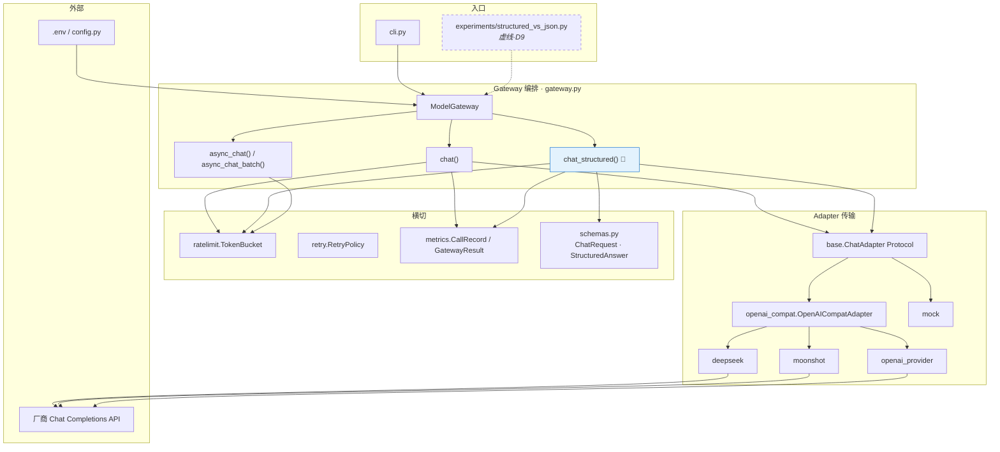
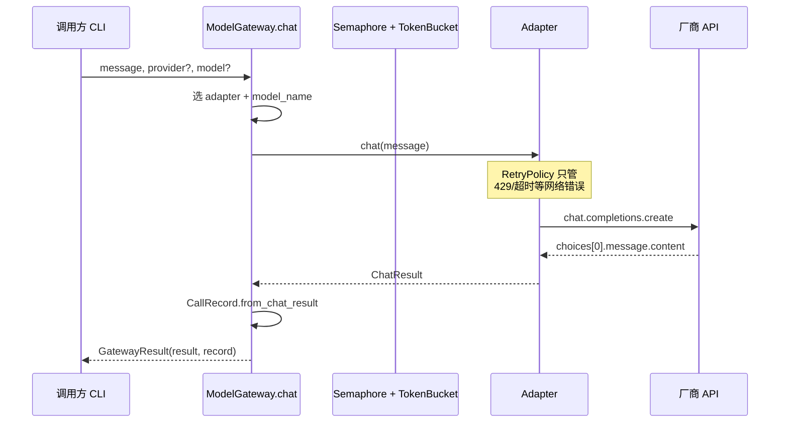
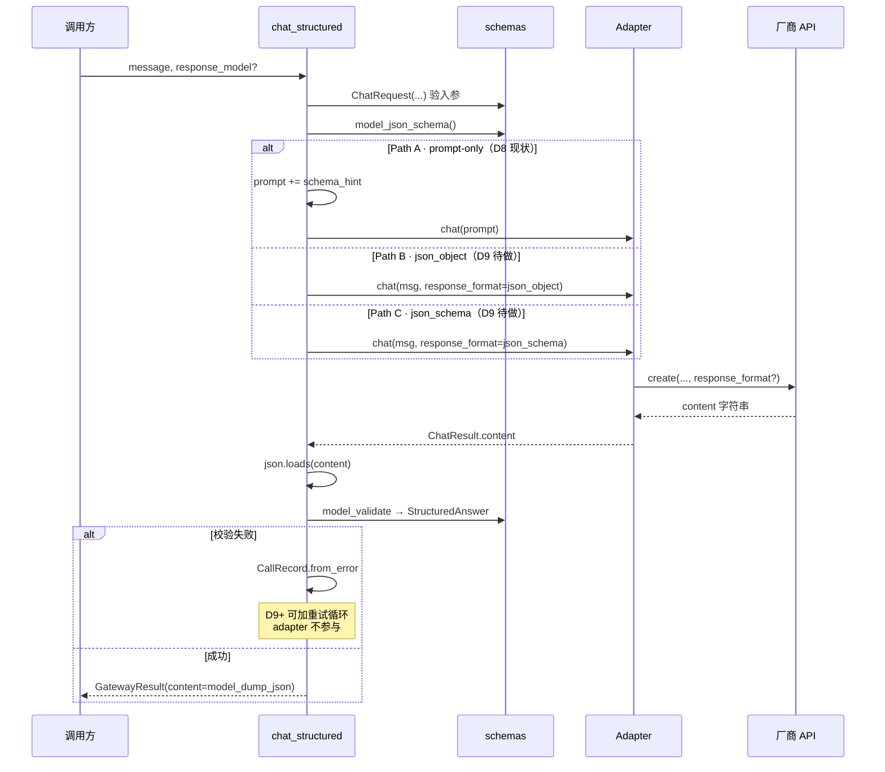
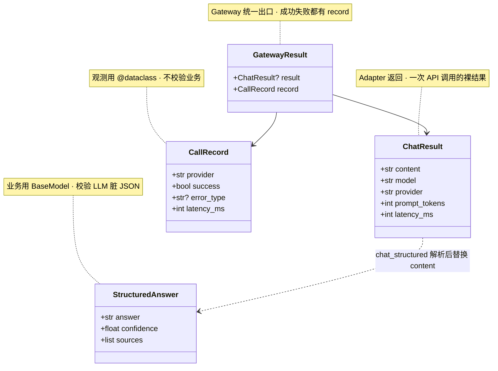
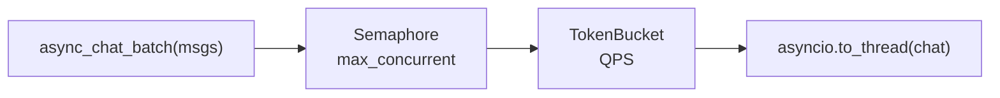

# P1 Model Gateway · 架构图（活文档）

**用途**：学习过程中边看边更新，脑子里始终有一张「数据从哪进、从哪出、谁负责什么」的图。  
**代码目录**：`coding/projects/01-model-gateway`  
**关联**：[P1-进度.md](./P1-进度.md) · [week-02.md](../../plan/weekly/week-02.md)

> 图例：`实线框` = 已实现 · `虚线框` = 计划/学习中 · `🔵` = 你当前在学

---

## 1. 分层总览（Cocos 类比）

```text
┌─────────────────────────────────────────────────────────────┐
│  CLI / 业务调用方          cli.py · experiments/*.py        │  ← 玩家点按钮
├─────────────────────────────────────────────────────────────┤
│  Gateway 编排层            gateway.py                       │  ← GameDirector：路由、拼装、校验、降级
│    chat / chat_structured / async_chat / async_chat_batch   │
├─────────────────────────────────────────────────────────────┤
│  横切能力                  retry · ratelimit · metrics       │  ← 全局 Scheduler / 事件监听
├─────────────────────────────────────────────────────────────┤
│  Adapter 传输层            deepseek · moonshot · mock …     │  ← 网络层：只发包收包
│    OpenAICompatAdapter → SDK → 厂商 API                     │
├─────────────────────────────────────────────────────────────┤
│  配置                      config.py · .env · pricing.yaml  │
└─────────────────────────────────────────────────────────────┘
```

**铁律（D9 刚学的）**：

| 层 | 做什么 | 不做什么 |
|:---|:---|:---|
| Adapter | HTTP/SDK、`response_format` 透传、网络重试 | Pydantic 校验、业务降级 |
| Gateway | 拼 prompt/schema、解析 JSON、`model_validate`、记 `CallRecord` | 直接调 HTTP |
| CLI | 读用户输入、打印结果 | 知道 DeepSeek URL |

### 1.1 分层心法：正例 / 反例

**反例**：把 `StructuredAnswer.model_validate` 写进 `OpenAICompatAdapter.chat()`

| 坑 | 人话 |
|:---|:---|
| Mock 漏网 | mock 不继承 OpenAICompat，测试行为与线上不一致 |
| 普通 chat 误伤 | `chat("你好")` 也被 `json.loads`，纯文本全挂 |
| 换 schema 动网络层 | D10 `ToolArgs` 改 schemas，却在改 HTTP 封装 |
| 新厂商复制 | Gemini 原生 SDK 不继承 OpenAICompat，校验又得抄一份 |

**正例**：Adapter 只返回 `ChatResult.content` 字符串；`chat_structured()` 统一 parse + validate

| 好处 | 人话 |
|:---|:---|
| ds/kimi/dashscope 零重复 | 传输共享 OpenAICompat；结构化共享 `chat_structured` |
| mock 同流程 | mock 也走 Gateway 结构化通路，测的是真编排 |
| `chat()` 保持纯净 | 要 JSON 走 `chat_structured`，不强行绑定 |

**跨语言对照**

| 层 | TS | Java | C++ | Cocos |
|:---|:---|:---|:---|:---|
| Adapter（传输） | `fetch` 只返回 Response | RestTemplate 拿 String | socket 收 `std::string` | HttpClient 回调给 data |
| Gateway（结构化） | 服务层 `zod.parse` | Service + `@Valid` DTO | 业务模块 json 解析 | InventoryParser 解析背包 |

### 1.2 四问法：这个功能放哪层？

| 问题 | 答「是」→ 放哪 |
|:---|:---|
| 跟厂商 API 字段有关？（`response_format`、`base_url`） | Adapter |
| 跟业务 schema 有关？（`StructuredAnswer`、`ToolArgs`） | Gateway / `structured_output` |
| 所有 provider 都要走，含 mock？ | Gateway 或更上，别绑 OpenAICompat |
| 只有「要 JSON」的那条 API 需要？ | `chat_structured`，别放进 `chat()` |

**自检（原「隐含假设」的人话版）**：写下「我默认了哪件事？」——例如「以后只有 OpenAI 兼容厂商」——然后问「不成立时会多改几处？」

### 1.3 聚合 vs 多态：边界怎么把握？

P1 里**两种机制同时存在**，别混为一谈：

```text
多态（继承/Protocol）  →  「怎么拿回复」不同
组合（注入部件）        →  「拿回复的套路相同」，复用 retry/timeout/config
配置（.env / dataclass）→  「算法不变，只变数字」
```

| 机制 | P1 例子 | 何时用 |
|:---|:---|:---|
| **多态** | `ChatAdapter.chat()`；DeepSeek/Moonshot 薄子类；Mock 独立实现 | 调用签名一样，**底层 IO/算法不同** |
| **组合** | `OpenAICompatAdapter` 注入 `RetryPolicy`、`ProviderConfig` | 算法通用，**可换部件**（测试可注入 `max_retries=0`） |
| **配置** | `get_gateway_timeout()`、`.env` 里的 `base_url` | 只变参数，**不值得为每种值建子类** |

**为何 `RetryPolicy` 不做多态子类？**  
deepseek 和 moonshot 重试规则相同（429/5xx 退避）→ 一个 `RetryPolicy` dataclass 够用。若 moonshot 要「只重试 429、不重试 500」，再考虑 `MoonshotRetryPolicy(RetryPolicy)` 或注入不同 `is_retryable` 函数——那是**行为真的分叉**了。

**为何 Mock 没有 RetryPolicy？**  
mock 不发 HTTP，重试无意义——多态允许 Mock **不组合** 这个部件，而不是给 Mock 写一个空转的 `RetryPolicySubclass`。

**口诀**：**行为分叉 → 多态；行为相同、部件可换 → 组合；只变数字 → 配置。**

---

## 2. 模块关系图（Mermaid）

复制到支持 Mermaid 的预览器可渲染；学新模块时往图里加节点。



---

## 3. 普通对话 `chat()` 数据流

**W1 已跑通**，复习用。



---

## 4. 结构化输出 `chat_structured()` 数据流

**D8 现状 + D9 要补的部分**（虚线 = 还没写进代码）。



**脑子里记这一张**：

```text
入参校验 ──→ 约束模型（prompt 或 response_format）──→ 拿纯文本 ──→ 出参校验
   ↑              Gateway                              Adapter      Gateway
 ChatRequest                                    只透传           json.loads + Pydantic
```

---

## 5. 数据模型（两类别搞混）



| 类型 | 装饰器 | 类比 TS |
|:---|:---|:---|
| `CallRecord` | `@dataclass` | 内部日志 struct |
| `StructuredAnswer` | `BaseModel` | `zod.parse()` 的业务类型 |

---

## 6. W2 学习进度叠加（随打卡更新）

把 `⬜` 改成 `✅` 时，回到 **§2 模块图** 把对应虚线框改成实线。

```text
W2 功能拼图
──────────────────────────────────────────────────
D8  ✅ schemas.py + chat_structured (Path A)
D9  ✅ response_format 透传 + 实验对比
D10 ✅ tools/registry.py + validate_args
D11 ✅ chat_with_tools + calculator E2E        ← 刚完成
D12 ✅ Moonshot 双模型切换
D13 ✅ fallback 概念（代码可选，见笔记 09）
D14 ⬜ P1 收尾 tag
──────────────────────────────────────────────────
```

**D9 完成后在 §2 要改的节点**：

- `openai_compat.chat()` 增加 `response_format` 参数
- `chat_structured(mode=...)` 三分支
- `experiments/structured_vs_json.py` 从虚线变实线

**D10 完成后要加的一条支路**：

```text
chat_with_tools → ToolRegistry.validate_args → adapter (tool_calls 消息格式)
```

**D11 已落地**：

```text
chat_with_tools
  → adapter.chat_messages(messages, tools)
  → ToolRegistry.call(calculator)   # eval_safe 本地执行
  → append assistant + role=tool
  → 再 chat_messages → 最终 content
CLI: tools calc | Debug: scripts/d11_chat_with_tools_debug.py
```

---

## 7. 异步路径（D4 已做，常忘）



批量请求走 `async_chat_batch`；同步 `chat` 不经过令牌桶（只有 async 路径限流）。

---

## 8. 学习时怎么更新本文档

每完成一个 D*，做三件事（5 分钟）：

1. **§6 进度表**打勾  
2. **§2 或 §4** 把虚线改实线，删掉「待做」字样  
3. **§9 个人备注**写一句你踩的坑

### §9 个人备注（你来填）

| 日期 | 学了什么 | 架构上搞清的一点 |
|:---|:---|:---|
| 2026-07-05 | D9 分层 | adapter 不校验，gateway 才 `model_validate` |
| | | |

---

## 9. 快速定位表

| 我想搞懂… | 看图 | 去看代码 |
|:---|:---|:---|
| 谁调 HTTP | §2 Adapter | `adapters/openai_compat.py` |
| 结构化输出全流程 | §4 | `gateway.chat_structured` |
| 失败怎么记日志 | §5 CallRecord | `metrics.py` |
| 429 谁重试 | §3 注释 | `retry.py`（网络，非校验） |
| 并发/QPS | §7 | `ratelimit.py` + `async_chat` |
| JSON mode vs schema | §4 alt 三分支 | `scripts/d9_json_mode_debug.py` |
